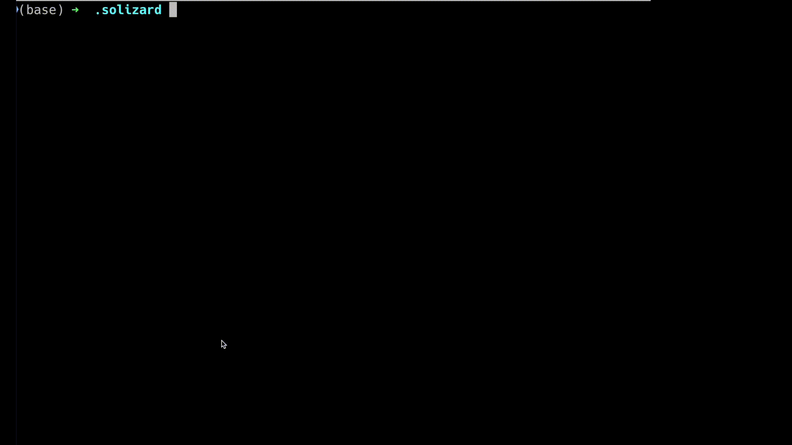

# Solizard :lizard:

Super easy interactive shell for interacting with smart contract on any evm chain.

## Features

- :scroll: Read contract state (Eth Call)
- :rocket: Write contract state (Eth SendTransaction)

## How to use

1. Install solizard `go install github.com/zsystm/solizard@latest`
2. Place your contract ABI in `$HOME/solizard/*.abi`
3. Run `solizard`

## Security

- private key is in memory and NEVER leaves the terminal
- NO backend, NO database, NO tracking
